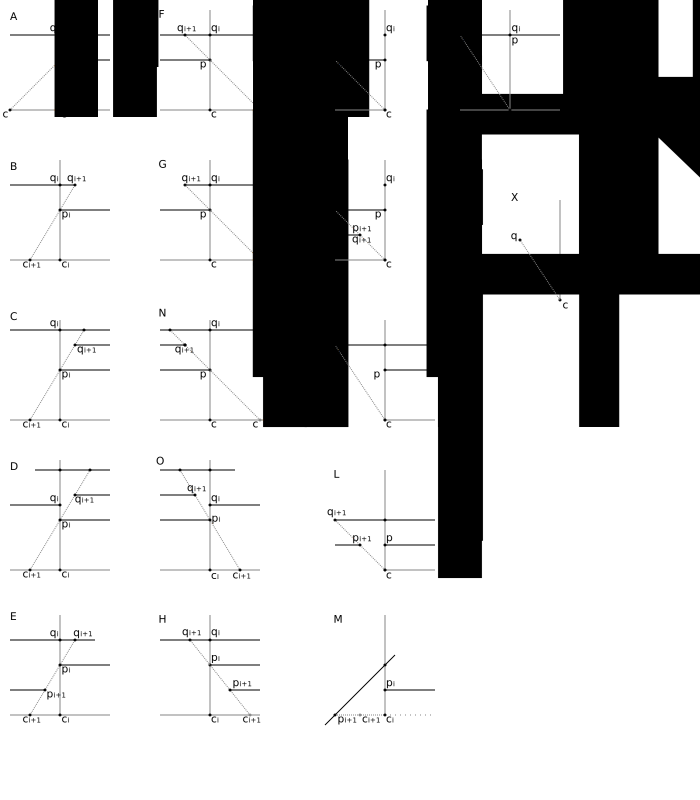

# Motivation

Some games consider visibility not just from a point source, which is the usual for the _visibility problem_ but from an area. Particularly games, which only allow grid positions, checking visibility from only one point - say the center - leads to artifacts.  But we can make some assumptions that may prove to be valuable, because of the "gamey" nature of the problem.

# Formulation

Let $(c^E\_i)\_{i=0..n}$ be the vertices of a convex polygon $C$, the _center_. Let $(p^E\_i)\_{i=0..m}$ be the vertices of a linear graph $P$ of _obstacles_ in the plane. The individual obstacles are usually identified by the irreducible subgraphs of this graph. We also identify the graph with its "embedding" in the plane; all edges are straight lines. Find the boundary of the visibility region $V(C)$, i.e. the set $\bigcup\lbrace(c, x):\[c,x\]\cap P=\emptyset, c\in C, x\in\mathbb{R}^2\rbrace$.

We make a further assumption that the $V(C)$ is bounded, i.e. the boundary will be a polygon. We also assume that the obstacles contain their intersections as points, i.e. any pairwise intersections of edges from $P$ is contained in the vertex set of $P$.

We also assume that $C\cap P=\emptyset$, i.e. $C$ does not intersect any obstacles. In the following, we do not distinguish between the _inner_ area and the _closed_ areas of a polygon, we will use whatever "fits" at the time. A strict formulation is left to the reader.

# Algorithm

Let all vertices of $C$be $V_0$. In step $n$, we use the standard, well-known algorithm on all of the vertices $V_n$ of $C$. Call the collection of visible obstacle points $P_n$ and add all found triangles to $V'(C)$. Let $P_n:=P_n\setminus\bigcup\lbrace P_i:i=0..n-1\rbrace$. We now find the visibility regions of all $p\in P_n$ but only as far as they see $C$. Add all triangles and their "opposites" to $V'(C)$, see figure (A). Collect all $c, c'$ into $V_{n+1}$ and let $V_{n+1}:=V_{n+1}\setminus\bigcup\lbrace V_i:i=0..n-1\rbrace$. Continue until $V_n$ is empty for some $n$.

We need to prove that the algorithm terminates and $V'(C)=V(C)$.

The set $M = (c^E\_i)\_{i=0..n}\cup(p^E\_i)\_{i=0..m}$ is finite, therefore the set of intersection points $I_C(M)$ of the complete graph on $M$ is also finite. $V_n\subset I_C(M)$ for all $n$. Since the $V_n$ are pairwise disjoint, we conclude that at some point, all $V_n$ will be empty. (The runtime asympotics are much better than this simple proof suggests.)

Obviously, $V'(C)\subset V(C)$. Take any $p_0\in V(C)$ and let the endpoint of one of its line-of-sight be $c_0$. We are done, if $c_0\in\bigcup V_n$. Assume otherwise and rotate around $p_0$ and follow $c$ as it moves along the boundary of $C$. If we encounter a $c_1\in\bigcup V_n$ before we encounter an obstacle in either direction, we know, that $p_0\in V'(C)$ by correctness of the algorithm when determining the field of vision for $c_1$. So assume that we encounter some obstacle $p_1$ first. Now rotate around $p_1$. If we first encounter a $c_2\in\bigcup V_n$ before we encounter an obstacle (on the rays from $p_0$ in the direction of $C$) we are done again by correctness of the algorithm when determining the field of vision for $c_2$. So assume that we encounter some obstacle $p_2$ first. Continuing this argument, we eventually find a $c_n\in\bigcup V_n$, because the set $P$ is finite.
